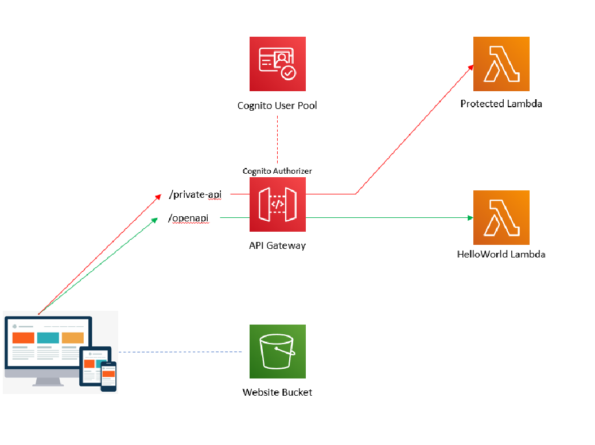
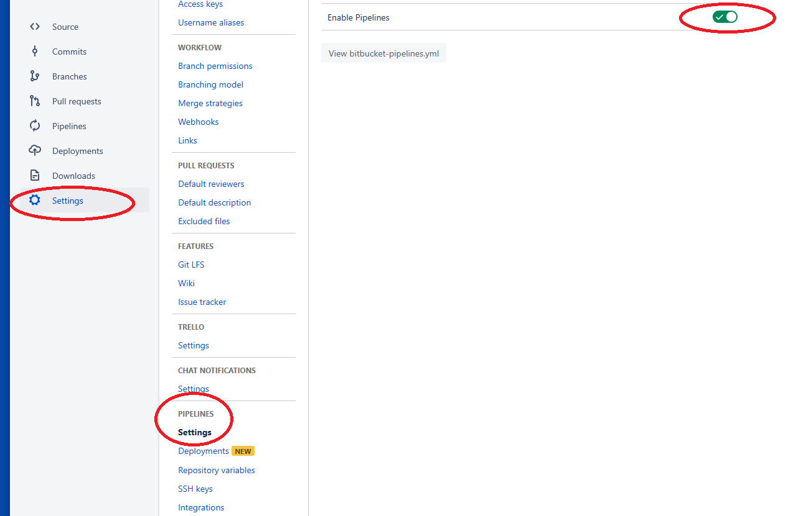
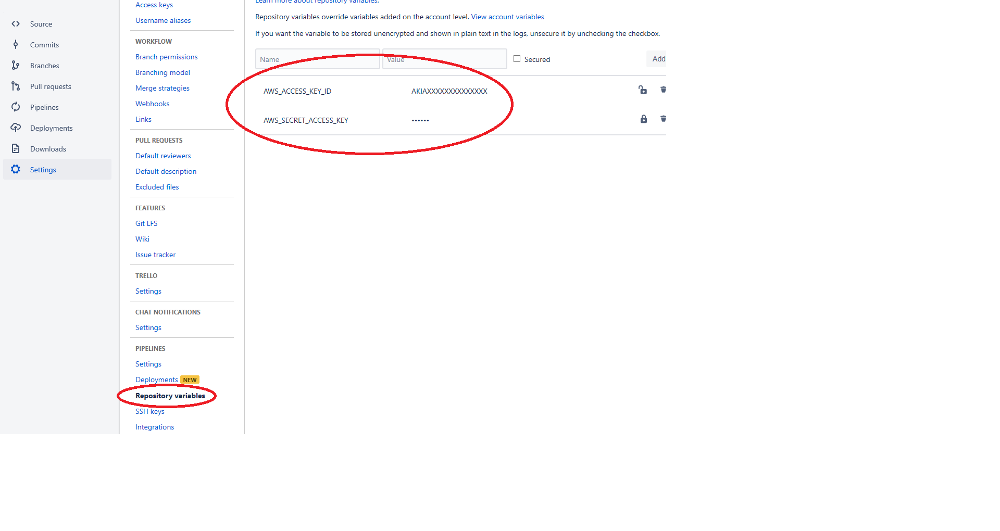
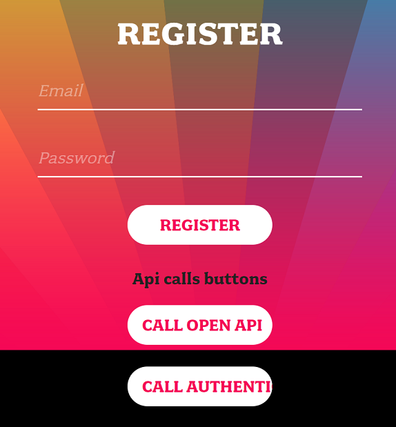
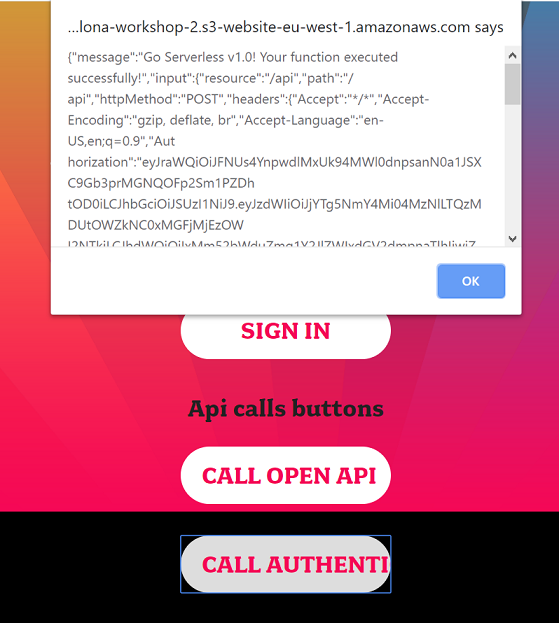

# Serverless Workshop 1

This PoC is part of the Serverless Workshop organized by the [Serverless Barcelona Meetup][meetup]. 
It is implemented with the [Serverless Framework][serverless] and not meant for production environments.
The purpose of this workshop is to explain how to deploy a typical use case adopting the serverless services that AWS offers. 

# What contains?

  - A serverless stack deployable in an AWS account.
  - A Bitbucket pipeline to deploy the stack.
  - A Dockerfile used by the Bitbucket pipeline.
  - The website code.

# Stack details

The stack will deploy:

- A website bucket where to store static HTML and JS.
- An Api-Gateway endpoint with two paths (/private-api /open-api )
- A Cognito User Pool where to create users and to use with the Api-Gateway Authorizer to protect the api calls which arrive to the /private-api
- A Lambda which responds to the /open-api path
- A Lambda which responds to the /private-api

# How to deploy through Bitbucket pipeline

- Clone this repo to a private repository in your Bitbucket account.
- Enable the pipeline in your bitbucket repository:

- Configure the repository variables:

- Change the service name in the serverless.yml file (fill it with another one, ie: serverless-workshop-YOUR_AWS_ACCOUNTID)
- Push the changes to the master branch to trigger the pipeline and deploy the stack

# How to try the stack

- Open the website bucket Url in your browser (you can find it in the pipeline output or in the Cloudformation stack output)

- Try to click on the CALL AUTHENTICATED button, you will receive a 401 response (Unauthorized)
- Register a new user with a valid email address
- Confirm the registration by inserting the code that you will receive by mail
- Sign in
- Try the CALL AUTHENTICATED button again, you will receive a message like that:

# Notes
All the steps must be followed in the correct order, in case something goes wrong and you want to recreate a user with the same email, you must go to the Cognito User Pool console --> Users and Groups, and disable/delete the user.
We know, the UX is not the best one, but the PoC is built to start with the serverless framework, Cognito, Api-Gateway, Authorizer and Lambda.

[//]: # (These are reference links used in the body of this note and get stripped out when the markdown processor does its job. There is no need to format nicely because it shouldn't be seen. Thanks SO - http://stackoverflow.com/questions/4823468/store-comments-in-markdown-syntax)

 [meetup]: <https://www.meetup.com/it-IT/Serverless-Barcelona/>
 [serverless]: <https://serverless.com/>